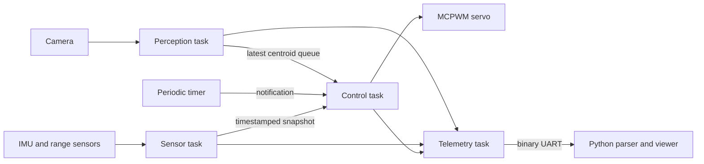

# Architecture to implement

This is a proposed starting design, not measured firmware behavior.

Use at least the three tasks in the brief; a fourth telemetry task keeps serial backpressure away from control. Start without core pinning and measure before changing placement.

| Task | Initial design target | Priority relationship | Must not do |
|---|---|---|---|
| Control | 50 Hz / 20 ms | Highest application priority among these tasks | Wait for a frame, echo, or serial write |
| Sensors | IMU 100 Hz; range about 10 Hz if module permits | Below control, above perception initially | Busy-wait indefinitely for ECHO |
| Perception | Best effort, start 160×120 | Below sensors initially | Hold frame buffers or grow queues unbounded |
| Telemetry | 20 Hz snapshots | Low | Block a producer on a slow host |

These rates are design choices. Sensor documentation and measured processing times decide final rates. The RTOS system also has tasks; avoid arbitrary maximum priorities.

## Ownership and freshness

One task owns each sensor driver. The sensor task can schedule IMU work frequently and range work less often using bounded asynchronous acquisition. Keep driver calls and I2C transactions out of interrupt callbacks. A timer callback should wake control, not execute PID, print logs, or acquire mutexes. Use ISR-safe APIs only in actual ISR context; use normal APIs for task-dispatched callbacks.

Send value structs through queues; do not queue pointers to stack locals or returned camera frame buffers. A queue of length one with overwrite semantics is useful for the latest centroid. Include capture timestamp, validity, pixel X/Y, and confidence. Record drops and sample age instead of pretending every frame was processed.

Read coherent sensor snapshots using a queue or a short protected copy. Never hold a lock during I/O. Start with a 200 ms target-observation timeout, document it, and test target loss. Invalid range is not zero range. Old orientation must not be paired silently with new range.

Separate acquisition time from transmission time. For mapping, buffer orientation samples and interpolate at range time when feasible; otherwise reject excessive skew and report the allowed bound. A single transmit timestamp alone is insufficient for moving scenes.

## Proposed file boundaries

Create these during the milestones: `firmware/main/app_main.c`, `board_config.h`, `imu.c/.h`, `range.c/.h`, `servo.c/.h`, `vision.c/.h`, `control.c/.h`, `telemetry.c/.h`; `host/protocol.py`, `geometry.py`, `viewer.py`; and matching focused tests. Declare component dependencies and source files in CMake when each module is added.

Log control period, worst/p95 jitter, task stack high-water marks, free heap, dropped frames, queue overruns, stale samples, CRC failures, and resets. A fast average rate can still hide missed deadlines.
